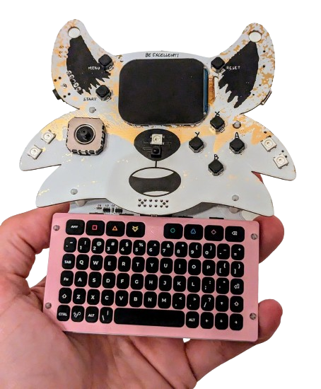

# Communicator 2024
In deze Git repository kan je de ontwerpbestanden en productiedata vinden van de [Fri3d Camp](https://fri3d.be/) 2024 communcator add-on. Revisie 01 is de versie die je in de zakjes kan terugvinden.

De PCB bevat volgende elementen:

- [LANA TNY](https://phyx.be/LANA_TNY/) controller bord voor het keyboard
- [I²S Microfoon](Datasheets/MIC.pdf)
- [I²S DAC met versterker](Datasheets/AMP.pdf)

In de zak zal je ook nog volgende items aantreffen:

- [Luidspreker](Datasheets/SPK.pdf)
- 2 lange pin headers
- Cover PCB
- 4 lange plastieken spacers
- 4 korte plastieken spacers

Je zal zelf de speaker en pin headers nog moeten solderen, het siliconen keyboard op de PCB monteren met de afdekplaat en het op de badge klikken.

Het keyboard werkt ook als USB keyboard. Maar plug de USB kabel niet in wanneer de badge verbonden is!




## Communicator 2024 (EN)
This repository contains the hardware design and production files for the [Fri3d Camp](https://fri3d.be/en/) 2024 Communicator add-on.

# Programming the LANA Module
To program the communicator you can use [Embeetle IDE](https://embeetle.com/). This is an IDE of Belgian make. The
[LANA](https://phyx.be/LANA_TNY/) on the communicator can be programmed with [Embeetle](https://embeetle.com/) via the USB connector but also with the [WCH-Link debugger]
(https://www.wch-ic.com/products/WCH-Link.html), this gives extra debugging options.

The makers of [Embeetle](https://embeetle.com/) have been so kind to [add the LANA board and very nice documentation](https://embeetle.com/#supported-hardware/wch/boards/lana-tny-01).

&nbsp;<br>
## STEP 1: Download Embeetle IDE
First download Embeetle at [https://embeetle.com/downloads](https://embeetle.com/#embeetle-ide/download). You can download it for either Windows or Linux.


&nbsp;<br>
## STEP 2: Launch the `lana-tny-01-communicator-2024` project
As a Belgian company, we decided to put the `lana-tny-01-communicator-2024` project for our Belgian friends on the Embeetle server! Launch Embeetle and click 'CREATE PROJECT':


Then select `WCH` for the vendor (that's the vendor of the microcontroller) and look for the project `lana-tny-01-communicator-2024`:


Now click `CREATE` at the bottom. Embeetle IDE will download the sample project and also all the required tools automatically. Then Embeetle opens the project:


&nbsp;<br>
## STEP 3: Flash the firmware
Now click the `flash` button at the top. You might experience the following error now:
```
Failed to open USB device: Bus 001 Device 008: ID 4348:55e0
Error: Failed to open USB device on Windows
```
On Linux you might experience another issue:
```
Failed to open USB device: Bus 003 Device 010: ID 4348:55e0
Error: Failed to open USB device on Linux due to no enough permission
```
Let's fix this.

&nbsp;<br>
## STEP 4a: Install Zadig (Windows only)
You must install [Zadig](https://zadig.akeo.ie/) and replace the driver for the USB device with the WinUSB driver. First, [download Zadig](https://zadig.akeo.ie/): 


Then, open Zadig and select Options -> List All Devices:


Select USB Module from the list of devices and choose WinUSB as the driver. Then click Replace Driver:


Wait for the driver installation to complete:


Success:


Try again in Embeetle IDE. It should work now: 

```
"C:/Users/krist/EMBEETLE IDE/embeetle/beetle_tools/windows/wchisp_0.2.2_64b/wchisp.exe" flash application.elf
14:57:06 [INFO] Chip: CH32V203G6U6[0x3619] (Code Flash: 32KiB)
14:57:06 [INFO] Chip UID: CD-AB-19-97-D0-BC-B6-FF
14:57:06 [INFO] BTVER(bootloader ver): 02.70
14:57:06 [INFO] Code Flash protected: false
14:57:06 [INFO] Current config registers: a55aff0000ff00ffffffffff00020700cdab1997d0bcb6ff
RDPR_USER: 0x00FF5AA5
  [7:0]   RDPR 0xA5 (0b10100101)
    `- Unprotected
  [16:16] IWDG_SW 0x1 (0b1)
    `- IWDG enabled by the software, and disabled by hardware
  [17:17] STOP_RST 0x1 (0b1)
    `- Disable
  [18:18] STANDBY_RST 0x1 (0b1)
    `- Disable, entering standby-mode without RST
  [23:22] SRAM_CODE_MODE 0x3 (0b11)
    `- CODE-228KB + RAM-32KB / CODE-160KB + RAM-32KB depending on the chip
DATA: 0xFF00FF00
  [7:0]   DATA0 0x0 (0b0)
  [23:16] DATA1 0x0 (0b0)
WRP: 0xFFFFFFFF
  `- Unprotected
14:57:06 [INFO] Read application.elf as ELF format
14:57:06 [INFO] Found loadable segment, physical address: 0x00000000, virtual address: 0x00000000, flags: 0x5
14:57:06 [INFO] Section names: [".init", ".vector", ".text"]
14:57:06 [INFO] Found loadable segment, physical address: 0x00000dbc, virtual address: 0x20000000, flags: 0x6
14:57:06 [INFO] Section names: [".data"]
14:57:06 [INFO] Firmware size: 4096
14:57:06 [INFO] Erasing...
14:57:06 [WARN] erase_code: set min number of erased sectors to 8
14:57:06 [INFO] Erased 8 code flash sectors
14:57:07 [INFO] Erase done
14:57:07 [INFO] Writing to code flash...
██████████████████████████████████████ 4096/409614:57:07 [INFO] Code flash 4096 bytes written
14:57:08 [INFO] Verifying...
██████████████████████████████████████ 4096/409614:57:08 [INFO] Verify OK
14:57:08 [INFO] Now reset device and skip any communication errors
14:57:08 [INFO] Device reset
```

## STEP 4b: Add device to plugdev group (Linux only)
On Linux you'll have to add the device to the plugdev group. You can find the documentation here:
[https://embeetle.com/#supported-hardware/wch/boards/lana-tny-01](https://embeetle.com/#supported-hardware/wch/boards/lana-tny-01)  >  3.Installation > 3.1 Flash firmware over USB-C port > Linux

Send a whatsapp msg to me if it doesn't work:
+32 496 90 75 44

## Notes on LANA module
If you are going to work with the blaster/LANA TNY yourself, you have to pay attention to 1 thing (regardless of the IDE) that is that LANA does not have an external clock and must use the internal clock (HSI), this is also stated in the default sketch of [Embeetle](https://embeetle.com/).
If you accidentally "brick" your [LANA](https://phyx.be/LANA_TNY/) board, you can usually unbrick it via USB or by using the power reset feature of the [WCHISPTool](https://www.wch-ic.com/downloads/WCHISPTool_Setup_exe.html).


