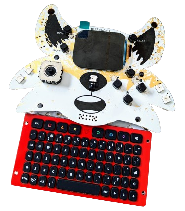
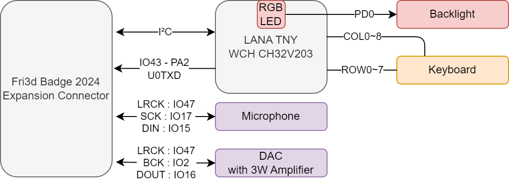

# Communicator 2024
In deze Git repository kan je de ontwerpbestanden en productiedata vinden van de [Fri3d Camp](https://fri3d.be/) 2024 communcator add-on. Revisie 01 is de versie die je in de zakjes kan terugvinden.

De PCB bevat volgende elementen:

- [LANA TNY](https://phyx.be/LANA_TNY/) controller bord voor het keyboard
- [I²S Microfoon](Datasheets/MIC.pdf)
- [I²S DAC met versterker](Datasheets/AMP.pdf)

In de zak zal je ook nog volgende items aantreffen:

- [Luidspreker](Datasheets/SPK.pdf)
- 2 lange pin headers
- Cover PCB
- 4 lange plastieken spacers
- 4 korte plastieken spacers

Je zal zelf de speaker en pin headers nog moeten solderen, het siliconen keyboard op de PCB monteren met de afdekplaat en het op de badge klikken.

Het keyboard werkt ook als USB keyboard. Maar plug de USB kabel niet in wanneer de badge verbonden is!

# Communicator 2024 (EN)
This repository contains the hardware design and production files for the [Fri3d Camp](https://fri3d.be/en/) 2024 Communicator add-on.

